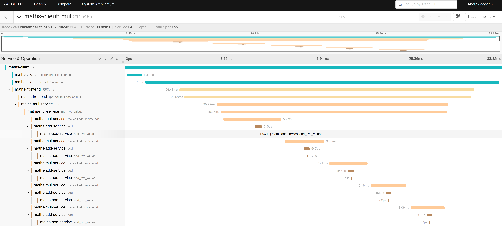

# Multi-service tracing example

This is an example project that shows how to enable multi-service tracing using `rust-tracing` `opentelemetry` and `jaeger` when using `tonic` for communication over gRPC.

When running, we will be able to visualise request traces in Jaeger like the image below.

The example used here is completely contrived, and used purely to demonstrate tracing through multiple services - yes I know we don't need three services and a fat client to add two numbers :).

## Project structure

This project is structured as a Cargo workspace, comprising of three services, one common crate, and one client for making the calls to the service.

- `maths-common` - This contains the proto definitions for all services, as well as some common functions.
- `maths-frontend-service` - This acts as a frontend to our services that do that actual work, and is the entrypoint for the client. This will proxy the requests to the right backend.
- `maths-add-service` - This is the backend service that does the addition work, and is invoked from the frontend service, or the mul service.
- `maths-mul-service` - This is the backend service that does the multiplication work, this is done by invoking the add service multiple times, and will be called from the frontend service.
- `maths-client` - A simple command line client to invoke the RPCs.

## Getting things running

We use [just](https://github.com/casey/just) to start and stop things and the available commands can be found in the `justfile`.

- `start` - Build and start all of the maths-* services.
- `stop` - Kill all of the maths services.
- `start-jaeger` - Starts the `jaegertracing/all-in-one` docker container.
- `stop-jaeger` - Stops the Jaeger container.

## How it works

Getting things going has been based off of the [opentelemetry-rust example](https://github.com/open-telemetry/opentelemetry-rust/tree/main/examples/tracing-grpc). We follow the same pattern, but having extracted some of the common code to the `maths-common` crate.

Most of the magic is in the `maths-common/src/lib.rs` file - see the following functions:
- `otel_jaeger_init(service_name: &str)` - This will setup otel and jaeger for your service - _Note: The services use a batch pipeline processor, set here. The client uses a simple one._
- `trace_req<T>(req: T) -> Request<T>` - This will take your proto payload, and create the `tonic::Request` for you, ensuring that the curent span is injected into the request. This is how requests in this example are created.
- `fn set_trace_ctx<T>(req: &Request<T>)` - This will extract the trace context out of a `tonic::Request` and set it as the current spans parent. This is called in all of the tonic async RPC handlers.

_TODO: There is also commented out code for a tonic interceptor that does not work... I suspect it is due to when the interceptor runs, and it not being in a span._

## License

This is licensed under the Apache 2.0 license.

